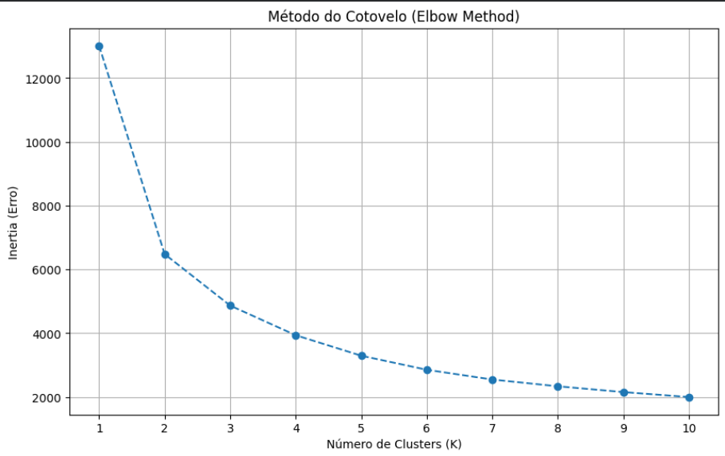
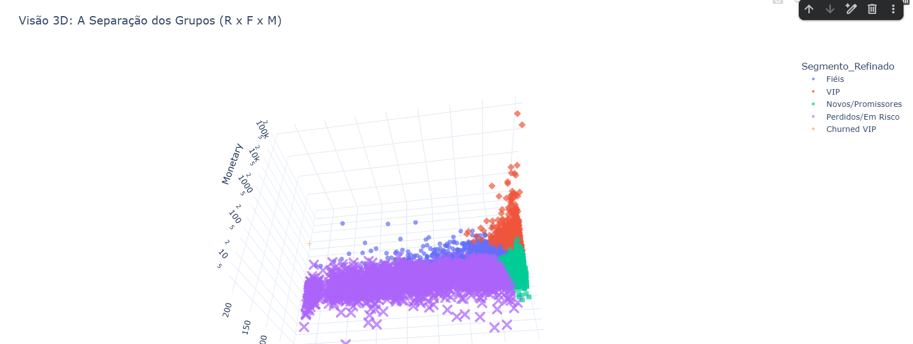

# 🛒 Segmentação de Clientes com K-Means & RFM

> **Área:** Data Science / Marketing Analytics  
> **Tecnologias:** Python, Scikit-learn, Pandas, Plotly, PyGWalker

## 💼 O Problema de Negócio
Uma empresa de varejo precisava otimizar suas campanhas de marketing.

O objetivo deste projeto foi abandonar a intuição e utilizar **Machine Learning não-supervisionado** para segmentar a base de clientes automaticamente, permitindo ações personalizadas para:
1.  Reter os melhores clientes (VIPs).
2.  Recuperar clientes que pararam de comprar (Perdidos/Em Risco).
3.  Identificar novos potenciais (Novos/Promissores).

## 📂 Fonte dos Dados
O dataset utilizado neste projeto é o **Online Retail**, disponibilizado publicamente pelo [UCI Machine Learning Repository](https://archive.ics.uci.edu/dataset/352/online+retail).

* **Conteúdo:** Transações de um varejo online baseada no Reino Unido (e-commerce).
* **Período:** 01/12/2010 a 09/12/2011.
* **Volume:** +500.000 transações.

---

## 🛠️ Metodologia e Decisão Técnica

### 1. Engenharia de Atributos (RFM)
Transformei dados transacionais brutos em comportamento de compra:
* **Recency (R):** Recência, dias desde a última compra.
* **Frequency (F):** Frequência, quantidade total de compras.
* **Monetary (M):** Monetário, total gasto na história.

### 2. Definição do Número de Clusters (Elbow Method)
Para não "chutar" o número de grupos, utilizei o **Método do Cotovelo (Elbow Method)**. O gráfico abaixo mostra que a inércia (erro) diminui drasticamente até **K=4**, indicando que 4 é o número matemático ideal de segmentos para esta base.



---

## 🔍 Resultados e Insight de Negócio

O algoritmo identificou 4 perfis distintos. Porém, a maior descoberta veio na análise pós-modelagem.

### O Fenômeno "Churned VIP"
Identifei no gráfico um cliente matematicamente classificados como VIPs (alto gasto histórico), mas que não compravam há mais de 1 ano. 

Apliquei a seguinte **Regra de Negócio**:
* **Regra:** Se `Cluster == VIP` e `Recency > 90 dias` ➔ Reclassificar para **"Churned VIP"**.
* **Impacto:** Apenas 3.5% dos VIPs demoram mais de 90 dias para voltar. Quem passa desse prazo é um risco crítico.

O gráfico abaixo mostra essa separação: o ponto em destaque é a situação do **ex-VIPs** que precisam de contato telefônico imediato, sendo separado dos VIPs ativos (Vermelho) em um novo cluster na próxima etapa.


| Cluster Final | Perfil Comportamental | Ação Recomendada |
| :--- | :--- | :--- |
| **VIP** | Compram a cada 12 dias, gastam 15x mais. | *Fidelidade e Atendimento Exclusivo.* |
| **Churned VIP** | Ex-VIPs inativos há >90 dias. | *Ligação pessoal (Resgate).* |
| **Novos / Promissores** | Recência baixa, mas poucas compras. | *Onboarding e Cross-sell.* |
| **Fiéis** | Boa frequência, gasto intermediário. | *Incentivos para aumentar Ticket Médio.* |
| **Perdidos/Em Risco** | Inativos há > 6 meses. | *Campanhas de reativação massiva.* |

---

## 📊 Visualização 3D dos Clusters

Para entender a separação espacial das três variáveis (R, F, M) simultaneamente, gerei uma visualização tridimensional. 
Note como o grupo **VIP (Laranja)** se descola da massa no topo do eixo vertical (Monetário) e à esquerda (Recência zero).



---

## 📦 Como Executar este Projeto

1. Clone o repositório:
   ```bash
   git clone https://github.com/lioradopacio/segmentacao-avancada-clientes-rfm-kmeans.git

2. Instale as dependências:
   ```bash
   pip install -r requirements.txt

3. Execute o Notebook:
      ```bash
      jupyter notebook "Segmentação_Avançada_Clientes(RFM_K_Means).ipynb"

Autor: Liora Dopacio
LinkedIn: (https://www.linkedin.com/in/liora-dopacio)
